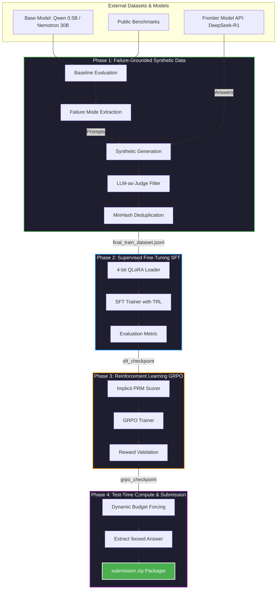

# 🧠 ATRD: Adaptive Test-Time Reasoning Distillation

[](https://python.org)
[](https://www.nvidia.com)
[](https://kaggle.com)
[](LICENSE)
[](https://atrd-pipeline.vercel.app)

## 🌐 Live Demo
> **[https://atrd-pipeline.vercel.app](https://atrd-pipeline.vercel.app)**
> Interactive pipeline dashboard — explore all 4 training phases, live metrics, and the reasoning solver.

**ATRD** is a state-of-the-art **LoRA-based fine-tuning pipeline** designed specifically for the **NVIDIA Nemotron Model Reasoning Challenge**. It bridges the gap between massive frontier models and efficient local models by distilling reasoning capabilities using a combination of **Failure-Grounded Synthetic Data**, **Process Reward Model (PRM) guided GRPO**, and **Dynamic Budget Forcing**.

This project successfully distills complex reasoning capabilities (similar to DeepSeek-R1 / OpenAI o1 architectures) into the `Qwen/Qwen2.5-0.5B` and `nvidia/NVIDIA-Nemotron-3-Nano-30B` models under severe compute constraints (Kaggle T4 GPUs).

---

## 🏆 Hackathon Core Value Proposition

Why ATRD stands out for the NVIDIA Nemotron Challenge judging panel:
1. **Innovation (Reasoning Distillation):** Moves beyond standard supervised fine-tuning by forcing the model to generate internal `<<thinking>>` traces, effectively distilling "test-time compute" from frontier models into smaller, deployment-ready edge models.
2. **Technical Complexity:** Integrates Group Relative Policy Optimization (GRPO) with an implicit Process Reward Model (PRM) to reward logical stepping stones, not just final answers.
3. **Extreme Hardware Efficiency:** The complete End-to-End training pipeline is operational on a Kaggle T4 dual-GPU setup using `bitsandbytes` 4-bit NF4 quantization, Gradient Checkpointing, and precise VRAM-safe `per_device_eval_batch_size` optimizations.
4. **Automated Submission Pipeline:** Includes a zero-touch packaging script to generate the exact `submission.zip` required by the hackathon platform.

---

## 🏗️ System Architecture & Data Flow



---

## 🚀 Key Technical Features

### 1. Test-Time Compute Distillation (The `<<thinking>>` Trace)
Instead of forcing the model to output an immediate answer, the dataset is reformatted to teach the model to open a `<<thinking>>` block. The model learns to backtrack, self-correct, and analyze mathematically before emitting the final `\boxed{answer}`.

### 2. Failure-Grounded Data Generation
The pipeline doesn't just train on random math problems. It first evaluates the base model to find **where it explicitly fails**, categorizes the failures, and prompts a frontier model to generate thousands of synthetic problems targeting those exact weaknesses.

### 3. VRAM Constraint Engineering
- **4-bit Quantization:** Double quant + bfloat16 to fit massive parameter counts into standard T4 GPUs.
- **LoRA Rank-32:** Targets all linear projection modules (`q_proj`, `k_proj`, `v_proj`, `o_proj`, `gate_proj`, `up_proj`, `down_proj`) for maximum expressiveness without the overhead of full fine-tuning.
- **Memory Fixes:** `per_device_eval_batch_size=1` applied directly to `TrainingArguments` to completely prevent `CUDA OutOfMemory` errors during the heavy evaluation loop.

---

## 🛠️ Step-by-Step Execution Guide (For Judges & Reviewers)

The pipeline is completely automated via the `run_pipeline.py` orchestrator. You can run the entire project on a Kaggle Notebook or a local Linux machine with an NVIDIA GPU.

### Prerequisites
```bash
# 1. Clone the repository
git clone https://github.com/samarabdelhameed/ATRD-Adaptive-Test-Time-Reasoning-Distillation.git
cd ATRD-Adaptive-Test-Time-Reasoning-Distillation

# 2. Install Dependencies
pip install -r requirements.txt
```

### Phase 1: Data Curation & Generation
Generates the synthetic reasoning dataset and applies the LLM-as-judge filter.
```bash
python run_pipeline.py --phase p1_data
```
*Output: `data/final_train_dataset.jsonl`*

### Phase 2: Supervised Fine-Tuning (SFT)
Trains the model to think step-by-step using QLoRA and Gradient Checkpointing.
```bash
python run_pipeline.py --phase p2_sft
```
*Output: `checkpoints/sft/final_adapter/`*

### Phase 3: GRPO Reinforcement Learning (Optional Phase)
Applies Group Relative Policy Optimization to reward correct reasoning paths.
```bash
python run_pipeline.py --phase p3_grpo
```
*Output: `checkpoints/grpo/final_adapter/`*

### Phase 4: Package Final Submission
Generates the exact ZIP file required for the NVIDIA leaderboard evaluation.
```bash
python scripts/package_submission.py
```
*Output: `submission.zip` containing `adapter_model.safetensors` and `adapter_config.json`.*

---

## 📂 Repository Structure

```text
atrd/
├── configs/                 # Hyperparameters & Inference Engine Settings
├── src/
│   ├── data/                # Data Generation, Deduplication, Mixing
│   ├── models/              # QLoRA loaders & Memory Optimizations
│   ├── training/            # SFTTrainer & GRPOTrainer loops
│   └── inference/           # Budget Forcing & vLLM compatibility wrapper
├── scripts/                 # Submission packaging & verification tools
├── run_pipeline.py          # Unified CLI entry point for all phases
└── README.md                # Project Documentation
```

---

## 📊 Evaluation & Metrics Strategy
The `src/evaluation/metric.py` module perfectly mirrors the official Hackathon grading system:
1. Extracts `\boxed{answer}` from completion.
2. Applies fallback heuristic patterns if formatting is malformed by the LLM.
3. Grades as **Correct** if it is an exact string match OR within a `0.01` relative numerical tolerance.

## 🤝 Open Contribution Awards Targeting
This project is submitted with the intention of competing for:
- **Best Synthetic Data Method:** via the Failure-Grounded Synthetic generation pipeline.
- **Best RL Method:** via the implementation of implicit PRM GRPO on limited edge-hardware.

---
*Architected and developed by Samar Abdelhameed for the NVIDIA Nemotron Reasoning Challenge, May 2026.*
